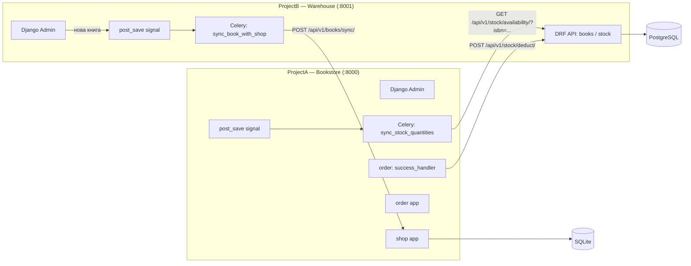

# Bookstore — основний застосунок книжкового магазину (ProjectA)

Основний Django-застосунок інтернет-книгарні (вітрина, кошик, оформлення замовлень, оплата через Stripe). Обмінюється даними зі складським мікросервісом **ProjectB — Warehouse** через REST API: отримує нові книги зі складу і повідомляє про списання залишків після оплати замовлення.

## Архітектура



Три напрямки міжсервісної комунікації:

| Напрямок | Тригер | Що відбувається |
|---|---|---|
| ProjectB → ProjectA | Нова книга створена на складі | Сигнал у ProjectB ставить Celery-таск у чергу → `POST /api/v1/books/sync/` у ProjectA → у `shop` створюється чернетка товару (`price=0`, `amount=0`, `available=False`) |
| ProjectA ← ProjectB | Періодичний Celery-таск `sync_stock_quantities` | ProjectA питає `GET /api/v1/stock/availability/?isbn=...` для кожної синхронізованої книги й оновлює кількість у себе |
| ProjectA → ProjectB | Успішна оплата замовлення (Stripe) | `order.success_handler` викликає `POST /api/v1/stock/deduct/`, щоб списати продану кількість зі складу |

> ⚠️ Точні назви ендпоінтів/таском викликів у `shop`/`order` наведені так, як вони описані з боку ProjectB. Якщо у вас інші назви — підкажіть, поправлю.

## Технології

- Django
- Django REST Framework (прийом `POST /api/v1/books/sync/` від ProjectB)
- SQLite (`db.sqlite3`)
- Celery (`sync_stock_quantities`, періодичний опитувальний таск)
- Stripe (оплата замовлень)
- Django Templates (вітрина, кошик, чекаут)

> ⚠️ Список орієнтовний — уточніть за `requirements.txt`/`settings.py`, якщо потрібна точна версія Django/DRF, брокер Celery (Redis?), JWT, i18n тощо — я не мав доступу до вмісту файлів репозиторію, лише до списку каталогів.

## Основні застосунки

- **bookstoreHW** — кореневий Django-проєкт (settings, urls, wsgi/asgi).
- **shop** — каталог книг, картки товару, кошик; приймає синхронізацію книг від ProjectB та періодично оновлює залишки.
- **order** — оформлення й обробка замовлень, інтеграція зі Stripe, `success_handler` після успішної оплати.
- **user_management** — кастомна модель користувача, реєстрація/логін/логаут.
- **templates** — спільні HTML-шаблони застосунку.

## Запуск

### 1. Клонувати і налаштувати оточення

```bash
git clone https://github.com/MatyVic/HillelDjangoHW.git
cd HillelDjangoHW
python -m venv .venv
.venv\Scripts\activate  # Windows
pip install -r requirements.txt
```

### 2. Налаштувати змінні оточення

Створіть `.env` за зразком (уточніть повний список ключів — Stripe ключі, `SECRET_KEY`, URL ProjectB тощо):

```
DJANGO_SECRET_KEY=...
STRIPE_SECRET_KEY=...
STRIPE_PUBLISHABLE_KEY=...
WAREHOUSE_SERVICE_URL=http://localhost:8001
```

### 3. Мігрувати БД і запустити сервер

```bash
python manage.py migrate
python manage.py createsuperuser
python manage.py runserver 8000
```

## Пов'язаний проєкт

**ProjectB — Warehouse** (`Warehouse_hillel_diploma`) — допоміжний мікросервіс складського обліку, з яким цей застосунок обмінюється даними.
